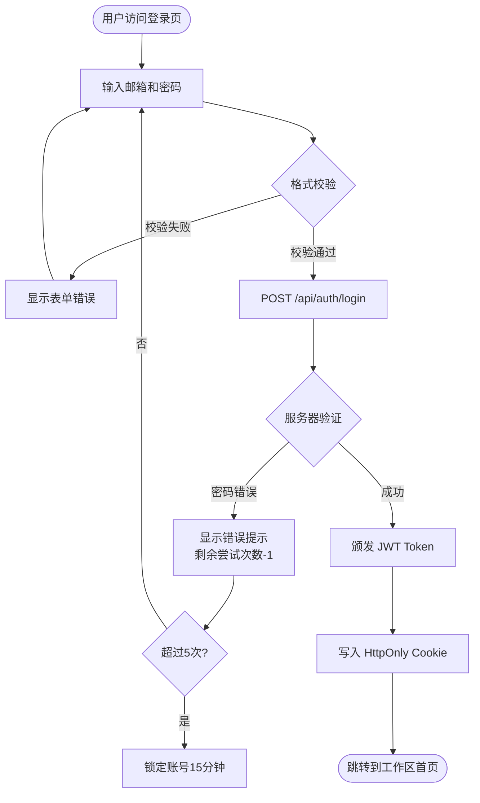

# ArchMind v0.5.0 开发设计文档

> 基于需求文档 v1.0 编写
> 文档版本：v1.0
> 创建日期：2026-03-03
> 状态：已定稿

---

## 一、总体设计原则

| 原则 | 说明 |
|------|------|
| **最小侵入** | RBAC 升级通过中间件改造实现，不改动现有业务逻辑 |
| **向后兼容** | `member` 角色自动映射为 `editor`，现有调用无需修改 |
| **异步优先** | 导出/导入/自动标签/逻辑图生成均异步执行，不阻塞主流程 |
| **数据隔离** | 所有新增表含 `workspace_id` + `user_id`，通过 DAO 层隔离 |
| **测试先行** | 每个功能对应单元测试，覆盖率维持 85% 以上 |

---

## 二、各功能设计详情

---

### #62 RBAC 精细权限系统

#### 改动文件

| 文件 | 操作 | 说明 |
|------|------|------|
| `lib/db/schema.ts` | 修改 | `workspaceRole` 枚举新增 `editor`、`viewer`、`guest` |
| `lib/auth/permissions.ts` | 新增 | RBAC 权限矩阵定义 + 工具函数 |
| `server/utils/auth-helpers.ts` | 修改 | 新增 `requireWorkspaceRole()` + 保留 `requireWorkspaceMember()` 别名 |
| `server/api/v1/workspaces/[id]/roles.get.ts` | 新增 | 获取角色权限矩阵 |
| `server/api/v1/workspaces/[id]/members/[userId]/role.patch.ts` | 新增 | 修改成员角色 |
| `server/api/v1/workspaces/[id]/permissions.get.ts` | 新增 | 获取当前用户有效权限 |
| `migrations/add-rbac-roles.sql` | 新增 | 数据库迁移（枚举扩展 + 新表）|
| `tests/unit/permissions.test.ts` | 新增 | 权限矩阵单元测试 |

#### 权限系统核心设计

**权限常量定义**（`lib/auth/permissions.ts`）：

```typescript
export type WorkspaceRole = 'owner' | 'admin' | 'editor' | 'viewer' | 'guest'
export type ResourceType = 'workspace' | 'document' | 'prd' | 'prototype' | 'logic_map' | 'webhook' | 'member'
export type Action = 'read' | 'write' | 'delete' | 'manage'

// 角色等级（数值越大权限越高）
export const ROLE_LEVELS: Record<WorkspaceRole, number> = {
  guest: 0,
  viewer: 1,
  editor: 2,
  admin: 3,
  owner: 4,
}

// 权限矩阵：resource:action → 最低需要的角色等级
export const PERMISSION_MATRIX: Record<string, number> = {
  'workspace:read':      ROLE_LEVELS.viewer,
  'workspace:write':     ROLE_LEVELS.admin,
  'workspace:delete':    ROLE_LEVELS.owner,
  'workspace:manage':    ROLE_LEVELS.admin,  // 设置、Webhook 等
  'document:read':       ROLE_LEVELS.viewer,
  'document:write':      ROLE_LEVELS.editor,
  'document:delete':     ROLE_LEVELS.editor,
  'prd:read':            ROLE_LEVELS.viewer,
  'prd:write':           ROLE_LEVELS.editor,
  'prd:delete':          ROLE_LEVELS.admin,
  'prototype:read':      ROLE_LEVELS.viewer,
  'prototype:write':     ROLE_LEVELS.editor,
  'prototype:delete':    ROLE_LEVELS.admin,
  'logic_map:read':      ROLE_LEVELS.viewer,
  'logic_map:write':     ROLE_LEVELS.editor,
  'logic_map:delete':    ROLE_LEVELS.editor,
  'webhook:manage':      ROLE_LEVELS.admin,
  'member:read':         ROLE_LEVELS.viewer,
  'member:manage':       ROLE_LEVELS.admin,
}

export function hasPermission(role: WorkspaceRole, resource: ResourceType, action: Action): boolean {
  const key = `${resource}:${action}`
  const required = PERMISSION_MATRIX[key]
  if (required === undefined) return false
  return ROLE_LEVELS[role] >= required
}
```

**`requireWorkspaceRole()` 实现**（`server/utils/auth-helpers.ts`）：

```typescript
// 新增函数（向后兼容）
export async function requireWorkspaceRole(
  event: H3Event,
  workspaceId: string,
  resource: ResourceType,
  action: Action
): Promise<{ userId: string; role: WorkspaceRole }> {
  const userId = requireAuth(event)
  const member = await workspaceMemberDAO.findByWorkspaceAndUser(workspaceId, userId)

  if (!member) {
    throw createError({ statusCode: 403, message: 'Not a workspace member' })
  }

  if (!hasPermission(member.role as WorkspaceRole, resource, action)) {
    throw createError({ statusCode: 403, message: `Insufficient permissions: requires ${resource}:${action}` })
  }

  return { userId, role: member.role as WorkspaceRole }
}

// 向后兼容别名（现有代码调用 requireWorkspaceMember 时等价于 viewer 角色）
export async function requireWorkspaceMember(
  event: H3Event,
  workspaceId: string,
  minRole: WorkspaceRole = 'viewer'
): Promise<{ userId: string; role: WorkspaceRole }> {
  return requireWorkspaceRole(event, workspaceId, 'workspace', 'read')
}
```

#### 数据库迁移

```sql
-- migrations/add-rbac-roles.sql

-- 1. 扩展角色枚举（PostgreSQL 枚举扩展需在事务外执行）
ALTER TYPE workspace_role ADD VALUE IF NOT EXISTS 'editor';
ALTER TYPE workspace_role ADD VALUE IF NOT EXISTS 'viewer';
ALTER TYPE workspace_role ADD VALUE IF NOT EXISTS 'guest';

-- 2. 将现有 member 角色迁移为 editor（向后兼容）
UPDATE workspace_members SET role = 'editor' WHERE role = 'member';

-- 3. 新增资源级权限覆盖表
CREATE TABLE IF NOT EXISTS workspace_permission_overrides (
  id            UUID PRIMARY KEY DEFAULT gen_random_uuid(),
  workspace_id  UUID NOT NULL REFERENCES workspaces(id) ON DELETE CASCADE,
  user_id       UUID NOT NULL REFERENCES users(id),
  resource_type TEXT NOT NULL,
  resource_id   UUID NOT NULL,
  action        TEXT NOT NULL,
  granted       BOOLEAN NOT NULL DEFAULT true,
  created_by    UUID REFERENCES users(id),
  created_at    TIMESTAMPTZ DEFAULT NOW(),
  UNIQUE(workspace_id, user_id, resource_type, resource_id, action)
);

CREATE INDEX IF NOT EXISTS idx_permission_overrides_workspace_user
  ON workspace_permission_overrides(workspace_id, user_id);
```

#### API 设计

**GET `/api/v1/workspaces/:id/permissions`**

```typescript
// 返回当前用户在该工作区的有效权限列表
{
  success: true,
  data: {
    role: 'editor',
    permissions: ['document:read', 'document:write', 'prd:read', 'prd:write', ...]
  }
}
```

**PATCH `/api/v1/workspaces/:id/members/:userId/role`**

```typescript
const Schema = z.object({
  role: z.enum(['editor', 'viewer', 'guest', 'admin'])  // owner 不可通过 API 修改
})
// 只有 admin+ 可执行，且不能设置比自己权限更高的角色
```

#### 前端组件变更

**邀请成员 Dialog 中的角色选择**：

```
角色选择（单选）：
  ● 编辑者   可上传文档、创建 PRD、生成原型
  ○ 只读者   可查看所有内容，不可编辑
  ○ 访客     仅可查看被分享的内容
  ○ 管理员   完整管理权限（不含删除工作区）
```

---

### #63 批量操作 API

#### 改动文件

| 文件 | 操作 | 说明 |
|------|------|------|
| `server/api/v1/documents/batch/delete.post.ts` | 新增 | 批量删除文档 |
| `server/api/v1/documents/batch/tag.post.ts` | 新增 | 批量标签操作 |
| `server/api/v1/documents/batch/category.post.ts` | 新增 | 批量设置分类 |
| `server/api/v1/documents/batch/reprocess.post.ts` | 新增 | 批量重新处理 |
| `server/api/v1/prd/batch/delete.post.ts` | 新增 | 批量删除 PRD |
| `server/api/v1/prd/batch/export.post.ts` | 新增 | 批量导出 PRD |
| `lib/utils/batch-handler.ts` | 新增 | 批量操作通用处理器 |
| `tests/unit/batch-handler.test.ts` | 新增 | 批量操作单元测试 |

#### 通用批量处理器设计

```typescript
// lib/utils/batch-handler.ts

interface BatchHandlerOptions<T, R> {
  items: T[]
  maxConcurrency: number  // 并发数，默认 5
  handler: (item: T) => Promise<R>
  onItemError?: (item: T, error: unknown) => void
}

interface BatchResult<T> {
  total: number
  succeeded: number
  failed: number
  errors: { id: string; code: string; message: string }[]
}

export async function runBatch<T extends { id: string }, R>(
  options: BatchHandlerOptions<T, R>
): Promise<BatchResult<T>> {
  // 使用 p-limit 控制并发，部分失败不影响其他项继续执行
}
```

**所有批量接口共用 Zod Schema**：

```typescript
// 基础批量操作 Schema（共用）
const BatchBaseSchema = z.object({
  ids: z.array(z.string().uuid()).min(1).max(100),
  workspaceId: z.string().uuid()
})
```

#### 文档批量删除端点

```typescript
// server/api/v1/documents/batch/delete.post.ts
export default defineEventHandler(async (event) => {
  const { ids, workspaceId } = await readValidatedBody(event, BatchBaseSchema.parse)
  const { userId } = await requireWorkspaceRole(event, workspaceId, 'document', 'delete')

  const result = await runBatch({
    items: ids.map(id => ({ id })),
    maxConcurrency: 5,
    handler: async ({ id }) => {
      // 校验文档归属于当前工作区，再删除
      await documentDAO.deleteIfBelongs(id, workspaceId, userId)
    }
  })

  return { success: true, data: result }
})
```

#### 前端多选模式设计

文档列表和 PRD 列表改动：

```
原有列：[标题][状态][时间][操作]
多选后：[☑][标题][状态][时间][操作]

操作栏（选中后出现在列表顶部）：
已选 12 项  [删除] [添加标签 ▾] [设置分类 ▾] [取消选择]
```

- 使用 `useSelection()` composable 封装多选逻辑
- 批量删除前使用 `AlertDialog` 二次确认
- 批量操作结果使用 Toast 汇报：「成功删除 10 项，2 项失败（权限不足）」

---

### #64 数据导出

#### 改动文件

| 文件 | 操作 | 说明 |
|------|------|------|
| `server/api/v1/workspaces/[id]/export.post.ts` | 新增 | 触发导出任务 |
| `server/api/v1/workspaces/[id]/export/[taskId].get.ts` | 新增 | 查询导出进度 |
| `server/api/v1/workspaces/[id]/export/[taskId]/download.get.ts` | 新增 | 下载导出文件 |
| `lib/export/workspace-exporter.ts` | 新增 | 导出核心逻辑 |
| `migrations/add-export-tasks.sql` | 新增 | 导出任务表（复用 `ai_tasks`，#69 统一）|

#### 导出器核心实现

```typescript
// lib/export/workspace-exporter.ts

export class WorkspaceExporter {
  async export(options: ExportOptions): Promise<string> {
    // 1. 创建临时目录
    const tmpDir = path.join('/tmp', `export-${nanoid()}`)

    // 2. 并行写入各资源目录
    await Promise.all([
      options.includeDocuments && this.exportDocuments(tmpDir, options),
      options.includePRDs && this.exportPRDs(tmpDir, options),
      options.includePrototypes && this.exportPrototypes(tmpDir, options),
    ].filter(Boolean))

    // 3. 写入 manifest.json
    await this.writeManifest(tmpDir, options)

    // 4. 压缩为 ZIP
    const zipPath = `${tmpDir}.zip`
    await this.compress(tmpDir, zipPath)

    // 5. 上传到临时存储（OBS 或本地 /tmp），返回 URL
    return await this.upload(zipPath)
  }
}
```

**进度上报**：通过更新 `ai_tasks.progress` 字段（0→20→40→60→80→100），前端通过 SSE 或轮询查询进度。

#### ZIP 结构规范

```
workspace-export-{name}-{YYYYMMDD}.zip
├── manifest.json
│   └── { version: '1.0', workspaceId, name, exportedAt, counts }
├── documents/
│   ├── index.json     # [{ id, title, fileName, tags, category, createdAt }]
│   └── files/
│       └── {id}.{ext} # 原始文件（includeOriginalFiles=true 时）
├── prd/
│   ├── index.json     # [{ id, title, status, rating, createdAt }]
│   └── {id}/
│       ├── content.md
│       └── snapshots/ # [{ version, content.md, createdAt }]（includeSnapshots=true）
└── prototypes/
    ├── index.json
    └── {id}/
        └── pages/
            └── {slug}.html
```

---

### #65 数据导入

#### 改动文件

| 文件 | 操作 | 说明 |
|------|------|------|
| `server/api/v1/workspaces/[id]/import.post.ts` | 新增 | 上传并触发导入任务 |
| `server/api/v1/workspaces/[id]/import/[taskId].get.ts` | 新增 | 查询导入进度 |
| `server/api/v1/workspaces/[id]/import/[taskId]/preview.get.ts` | 新增 | 获取冲突预览 |
| `server/api/v1/workspaces/[id]/import/[taskId]/confirm.post.ts` | 新增 | 确认并执行导入 |
| `lib/import/workspace-importer.ts` | 新增 | 导入核心逻辑 |

#### 导入流程实现

```typescript
// lib/import/workspace-importer.ts

export class WorkspaceImporter {
  // 第一步：解析 ZIP，返回冲突检测报告
  async analyze(zipPath: string, targetWorkspaceId: string): Promise<ImportAnalysis> {
    const manifest = await this.readManifest(zipPath)
    this.validateManifest(manifest)  // 版本/格式校验

    return {
      documentCount: manifest.counts.documents,
      prdCount: manifest.counts.prds,
      prototypeCount: manifest.counts.prototypes,
      conflicts: {
        documents: await this.detectDocumentConflicts(zipPath, targetWorkspaceId),
        prds: await this.detectPRDConflicts(zipPath, targetWorkspaceId),
      }
    }
  }

  // 第二步：执行导入（在事务中，失败全部回滚）
  async execute(
    zipPath: string,
    targetWorkspaceId: string,
    userId: string,
    strategy: ConflictStrategy
  ): Promise<ImportResult> {
    return await dbClient.transaction(async (tx) => {
      // 按 skip/overwrite/rename 策略处理冲突
      // 文档：写入 documents 表 + 上传原始文件到 OBS
      // PRD：写入 prd_documents 表
      // 原型：写入 prototypes + prototype_pages 表
    })
  }
}
```

**冲突检测规则**：
- 文档：按 `fileHash`（SHA-256）判断重复
- PRD：按 `title` + `workspaceId` 判断同名
- 原型：按 `name` + `workspaceId` 判断同名

---

### #66 逻辑图谱生成

#### 改动文件

| 文件 | 操作 | 说明 |
|------|------|------|
| `lib/db/schema.ts` | 修改 | 新增 `logic_maps` 表定义 |
| `lib/db/dao/logic-map-dao.ts` | 新增 | 逻辑图谱 DAO |
| `lib/logic-map/generator.ts` | 新增 | AI 生成引擎 |
| `lib/logic-map/prompts.ts` | 新增 | 各图形类型的 System Prompt |
| `server/api/v1/logic-maps/generate.post.ts` | 新增 | 生成接口（SSE）|
| `server/api/v1/logic-maps/index.get.ts` | 新增 | 列表接口 |
| `server/api/v1/logic-maps/[id]/index.get.ts` | 新增 | 详情接口 |
| `server/api/v1/logic-maps/[id]/index.patch.ts` | 新增 | 更新接口 |
| `server/api/v1/logic-maps/[id]/index.delete.ts` | 新增 | 删除接口 |
| `migrations/add-logic-maps.sql` | 新增 | 数据库迁移 |
| `pages/logic-maps/[id].vue` | 新增 | 逻辑图详情/编辑页 |
| `components/logic-map/LogicMapViewer.vue` | 新增 | Mermaid 渲染器组件 |
| `components/logic-map/LogicMapEditor.vue` | 新增 | 代码编辑器（含实时预览）|

#### AI 生成引擎设计

```typescript
// lib/logic-map/generator.ts

export class LogicMapGenerator {
  async *generateStream(request: GenerateLogicMapRequest): AsyncGenerator<string> {
    const prd = await prdDAO.findById(request.prdId)
    const systemPrompt = buildLogicMapSystemPrompt(request.type)

    // 构建用户 Prompt：提取 PRD 相关章节 + 聚焦描述
    const userPrompt = this.buildUserPrompt(prd.content, request.type, request.focus)

    // 调用 AI（流式输出 Mermaid 代码块）
    const adapter = await modelManager.getAdapter(request.modelId)
    yield* adapter.generateStream(`${systemPrompt}\n\n${userPrompt}`)
  }

  // 从流式输出中提取 Mermaid 代码（处理代码块标记）
  static extractMermaidCode(rawOutput: string): string | null {
    const match = rawOutput.match(/```mermaid\n([\s\S]*?)```/)
    return match?.[1]?.trim() ?? null
  }
}
```

**各图形类型的 System Prompt 核心要求**：

| 图形类型 | 核心要求 |
|---------|---------|
| `flowchart` | 必须包含异常分支（Error Path），节点命名用动词短语 |
| `sequence` | 标注系统边界（Internal/External），消息命名用 API 路径格式 |
| `state` | 每个状态必须有进入/退出条件，终态必须标注 `[*]` |
| `class` | 包含主要属性和方法，用 `+` `-` `#` 标注可见性 |

**流程图 Few-shot 示例**（写入 `lib/logic-map/prompts.ts`）：

```
用户登录流程示例输出：

```

#### 前端设计

**逻辑图详情页** (`pages/logic-maps/[id].vue`)：

```
┌─ 逻辑图标题 ─── [编辑] [导出SVG] [返回PRD] ─────────────────┐
│                                                               │
│  ┌── 预览区（70%）──────────────────────────────────────┐   │
│  │                                                       │   │
│  │          [Mermaid 渲染的 SVG 图形]                    │   │
│  │                                                       │   │
│  └───────────────────────────────────────────────────────┘   │
│                                                               │
│  ┌── 代码编辑区（30%，可折叠）──────────────────────────┐   │
│  │  flowchart TD                                         │   │
│  │    A[用户输入] --> B{校验}                            │   │
│  │    ...                                                │   │
│  │                          [实时渲染] [复制代码]         │   │
│  └───────────────────────────────────────────────────────┘   │
└───────────────────────────────────────────────────────────────┘
```

**Mermaid 渲染器**（`components/logic-map/LogicMapViewer.vue`）：

```typescript
// 使用 mermaid.js 库（需安装：pnpm add mermaid）
import mermaid from 'mermaid'

// 渲染失败时降级展示代码 + 错误提示
async function renderMermaid(code: string): Promise<string | null> {
  try {
    mermaid.initialize({ startOnLoad: false, theme: 'default' })
    const { svg } = await mermaid.render(`mermaid-${Date.now()}`, code)
    return svg
  } catch (e) {
    console.warn('[LogicMap] Mermaid 渲染失败', e)
    return null  // 降级展示代码
  }
}
```

---

### #67 PRD 模板系统

#### 改动文件

| 文件 | 操作 | 说明 |
|------|------|------|
| `lib/db/schema.ts` | 修改 | 新增 `prd_templates` 表定义 |
| `lib/db/dao/prd-template-dao.ts` | 新增 | PRD 模板 DAO |
| `lib/prd/template-engine.ts` | 新增 | 模板解析与 Prompt 构建 |
| `lib/prd/templates/` | 新增目录 | 6 个预设模板的 JSON 定义文件 |
| `server/api/v1/prd-templates/index.get.ts` | 新增 | 获取模板列表 |
| `server/api/v1/prd-templates/index.post.ts` | 新增 | 创建模板 |
| `server/api/v1/prd-templates/[id]/index.get.ts` | 新增 | 获取模板详情 |
| `server/api/v1/prd-templates/[id]/index.patch.ts` | 新增 | 更新模板 |
| `server/api/v1/prd-templates/[id]/index.delete.ts` | 新增 | 删除模板 |
| `server/api/v1/prd/stream.post.ts` | 修改 | 请求体新增可选 `templateId` |
| `scripts/seed-prd-templates.ts` | 新增 | 预设模板种子脚本 |
| `migrations/add-prd-templates.sql` | 新增 | 数据库迁移 |

#### 预设模板 JSON 格式

```typescript
// lib/prd/templates/standard.json
{
  "id": "standard",
  "name": "标准 PRD",
  "description": "通用功能性需求文档，适用于大多数功能开发场景",
  "type": "standard",
  "sections": [
    {
      "id": "background",
      "title": "背景与目标",
      "required": true,
      "instructions": "描述为什么要做这个功能，当前痛点是什么，解决什么问题",
      "minWords": 80
    },
    {
      "id": "users",
      "title": "目标用户",
      "required": true,
      "instructions": "描述受此功能影响的用户角色，用户规模，使用频率"
    },
    {
      "id": "user-stories",
      "title": "用户故事",
      "required": true,
      "format": "as-a-user",
      "instructions": "用 As a [角色], I want [目标], So that [价值] 格式描述，至少 3 条"
    },
    {
      "id": "functional-requirements",
      "title": "功能详述",
      "required": true,
      "instructions": "详细描述各功能点，包含正常流程和异常流程"
    },
    {
      "id": "non-functional",
      "title": "非功能性需求",
      "required": false,
      "instructions": "性能要求、安全要求、可用性要求"
    },
    {
      "id": "kpi",
      "title": "验收标准与 KPI",
      "required": true,
      "instructions": "明确可量化的验收标准，如响应时间、转化率目标等"
    }
  ]
}
```

#### 模板引擎实现

```typescript
// lib/prd/template-engine.ts

export class PRDTemplateEngine {
  // 根据模板构建专用 System Prompt
  buildSystemPromptFromTemplate(template: PRDTemplate): string {
    const sectionInstructions = template.sections
      .map(s => `## ${s.title}${s.required ? ' *（必填）*' : ''}
${s.instructions}
${s.minWords ? `最少 ${s.minWords} 字` : ''}`)
      .join('\n\n')

    return `你是一个专业的产品经理，请严格按照以下章节结构生成 PRD：

${sectionInstructions}

${template.systemPrompt ?? ''}

重要规则：
1. 严格按照上述章节顺序输出
2. 必填章节不可省略
3. 使用 Markdown 格式，每个章节以 ## 开头`
  }
}
```

#### `prd/stream.post.ts` 变更

```typescript
const StreamSchema = z.object({
  userInput: z.string().min(10),
  workspaceId: z.string().uuid(),
  documentIds: z.array(z.string().uuid()).optional(),
  modelId: z.string().optional(),
  templateId: z.string().optional().default('standard'),  // 新增
})
```

---

### #68 文档智能分类与自动标签

#### 改动文件

| 文件 | 操作 | 说明 |
|------|------|------|
| `lib/db/schema.ts` | 修改 | `documents` 表新增 5 个字段 |
| `lib/classification/auto-tagger.ts` | 新增 | AI 自动分类逻辑 |
| `server/api/v1/documents/[id]/confirm-tags.post.ts` | 新增 | 确认标签 API |
| `server/api/v1/documents/batch/auto-tag.post.ts` | 新增 | 批量触发自动标签 |
| `migrations/add-document-auto-tags.sql` | 新增 | 数据库迁移 |

#### 自动标签触发时机

文档向量化完成（`status = 'completed'`）后，在 `server/api/v1/documents/[id]/status` 更新处，使用 `setImmediate` fire-and-forget 触发：

```typescript
// server/api/v1/documents/[id]/process.post.ts（或文档处理 worker 中）
// 向量化完成后触发
setImmediate(async () => {
  try {
    const autoTagger = new AutoTagger()
    const result = await autoTagger.analyze(document.id)
    await documentDAO.updateAutoTags(document.id, result)
  } catch (e) {
    console.warn('[AutoTag] 自动标签失败，不影响文档使用', e)
  }
})
```

#### 自动标签 AI 实现

```typescript
// lib/classification/auto-tagger.ts

const AUTO_TAG_PROMPT = `
你是文档分类助手。分析文档内容，返回 JSON 格式的分类结果。

文档内容（前 2000 字）：
{content}

返回格式（严格 JSON，不要有多余文字）：
{
  "suggestedCategory": "产品需求",
  "suggestedTags": ["用户认证", "安全", "后端"],
  "documentType": "prd",
  "confidence": 0.92,
  "summary": "本文档描述了用户认证系统的设计方案，包含 JWT Token 的生成与验证流程"
}

可选的 documentType 值：prd / design / technical / report / other
可选的 suggestedCategory：产品需求 / 技术设计 / 用户研究 / 竞品分析 / 项目管理 / 运营数据 / 培训材料 / 其他
`

export class AutoTagger {
  async analyze(documentId: string): Promise<AutoTagResult> {
    const document = await documentDAO.findById(documentId)
    const content = document.extractedText?.slice(0, 2000) ?? document.title

    const adapter = await modelManager.getDefaultAdapter()
    const rawResponse = await adapter.generateText(
      AUTO_TAG_PROMPT.replace('{content}', content),
      { maxTokens: 300, temperature: 0.3 }
    )

    // 解析 JSON（带容错）
    return this.parseResponse(rawResponse)
  }
}
```

---

### #69 AI 任务队列与进度中心

#### 改动文件

| 文件 | 操作 | 说明 |
|------|------|------|
| `lib/db/schema.ts` | 修改 | 新增 `ai_tasks` 表定义 |
| `lib/db/dao/ai-task-dao.ts` | 新增 | AI 任务 DAO |
| `lib/tasks/task-manager.ts` | 新增 | 任务管理器（并发控制、队列）|
| `server/api/v1/tasks/index.get.ts` | 新增 | 获取任务列表 |
| `server/api/v1/tasks/[id].get.ts` | 新增 | 获取任务详情 |
| `server/api/v1/tasks/[id]/cancel.post.ts` | 新增 | 取消任务 |
| `server/api/v1/tasks/[id]/retry.post.ts` | 新增 | 重试失败任务 |
| `migrations/add-ai-tasks.sql` | 新增 | 数据库迁移 |
| `components/tasks/TaskCenter.vue` | 新增 | 任务中心面板 |
| `components/tasks/TaskIndicator.vue` | 新增 | 顶部任务指示器 |

#### 任务管理器设计

```typescript
// lib/tasks/task-manager.ts

export class AITaskManager {
  private readonly concurrencyLimits: Record<string, number> = {
    prd_generate: 2,
    prototype_generate: 1,
    logic_map_generate: 2,
    document_process: 3,
    workspace_export: 1,
  }

  // 创建任务（pending 状态）
  async createTask(type: string, userId: string, workspaceId: string, input: object): Promise<AITask>

  // 检查是否可以立即执行（未超并发限制）
  async canExecute(type: string, userId: string): Promise<boolean>

  // 标记任务开始（pending → running）
  async startTask(taskId: string): Promise<void>

  // 更新进度
  async updateProgress(taskId: string, progress: number): Promise<void>

  // 完成任务
  async completeTask(taskId: string, outputRef: string): Promise<void>

  // 失败任务
  async failTask(taskId: string, error: string): Promise<void>
}
```

**与现有 SSE 进度推送的整合**：

现有 PRD/原型生成接口的 SSE 进度事件，额外广播 `ai_task_update` 事件（通过 WebSocket 推送到所有该用户的活跃连接），确保任务中心实时更新，即使用户切换了页面。

#### 前端任务指示器

```vue
<!-- components/tasks/TaskIndicator.vue -->
<!-- 放置在顶部导航栏右侧 -->

<template>
  <Popover>
    <PopoverTrigger>
      <Button variant="ghost" size="icon" class="relative">
        <Icons.zap class="h-5 w-5" />
        <!-- 运行中任务数量 badge -->
        <Badge
          v-if="runningCount > 0"
          class="absolute -top-1 -right-1 h-4 w-4 animate-pulse"
        >
          {{ runningCount }}
        </Badge>
      </Button>
    </PopoverTrigger>
    <PopoverContent class="w-80">
      <TaskCenter />
    </PopoverContent>
  </Popover>
</template>
```

---

### #70 全局搜索增强

#### 改动文件

| 文件 | 操作 | 说明 |
|------|------|------|
| `server/api/v1/search/index.get.ts` | 新增 | 全局搜索 API |
| `server/api/v1/search/suggestions.get.ts` | 新增 | 搜索建议 API |
| `lib/search/global-searcher.ts` | 新增 | 全局搜索引擎 |
| `components/search/GlobalSearch.vue` | 新增 | Command Palette 组件 |

#### 全局搜索引擎设计

```typescript
// lib/search/global-searcher.ts

export class GlobalSearcher {
  async search(query: string, workspaceId: string, types: SearchType[]): Promise<SearchResults> {
    const useSemanticSearch = query.length >= 10

    const searchTasks = types.map(type => this.searchByType(query, type, workspaceId, useSemanticSearch))
    const results = await Promise.allSettled(searchTasks)

    return this.mergeAndRank(results, query)
  }

  private async searchByType(query: string, type: SearchType, ...): Promise<TypedSearchResult[]> {
    switch (type) {
      case 'document':   return this.searchDocuments(query, workspaceId, useSemanticSearch)
      case 'prd':        return this.searchPRDs(query, workspaceId)
      case 'prototype':  return this.searchPrototypes(query, workspaceId)
      case 'logic_map':  return this.searchLogicMaps(query, workspaceId)
    }
  }
}
```

**Command Palette 快捷键**：在 `app.vue` 的 `onMounted` 中注册：

```typescript
useEventListener(document, 'keydown', (e: KeyboardEvent) => {
  if ((e.metaKey || e.ctrlKey) && e.key === 'k') {
    e.preventDefault()
    isSearchOpen.value = true
  }
})
```

---

## 三、数据库变更汇总

| Issue | 迁移文件 | 表名 / 字段 | 变更类型 |
|-------|---------|-----------|---------|
| #62 | `migrations/add-rbac-roles.sql` | `workspace_role` 枚举 + `workspace_permission_overrides` | 枚举扩展 + 新增表 |
| #66 | `migrations/add-logic-maps.sql` | `logic_maps` | 新增表 |
| #67 | `migrations/add-prd-templates.sql` | `prd_templates` | 新增表 |
| #68 | `migrations/add-document-auto-tags.sql` | `documents` 新增 5 字段 | 修改表 |
| #69 | `migrations/add-ai-tasks.sql` | `ai_tasks` | 新增表 |

---

## 四、新增文件清单

```
lib/
├── auth/
│   └── permissions.ts                   # #62 RBAC 权限矩阵
├── logic-map/
│   ├── generator.ts                     # #66 逻辑图 AI 生成引擎
│   └── prompts.ts                       # #66 各图形类型 System Prompt
├── prd/
│   ├── template-engine.ts               # #67 模板引擎
│   └── templates/                       # #67 预设模板 JSON
│       ├── standard.json
│       ├── api-design.json
│       ├── bug-fix-spec.json
│       ├── feature-brief.json
│       ├── onboarding-flow.json
│       └── data-model.json
├── classification/
│   └── auto-tagger.ts                   # #68 自动标签
├── tasks/
│   └── task-manager.ts                  # #69 任务管理器
├── search/
│   └── global-searcher.ts               # #70 全局搜索
├── export/
│   └── workspace-exporter.ts            # #64 导出器
├── import/
│   └── workspace-importer.ts            # #65 导入器
├── utils/
│   └── batch-handler.ts                 # #63 批量处理器
└── db/dao/
    ├── logic-map-dao.ts                 # #66
    ├── prd-template-dao.ts              # #67
    └── ai-task-dao.ts                   # #69

server/api/v1/
├── workspaces/[id]/
│   ├── roles.get.ts                     # #62
│   ├── permissions.get.ts               # #62
│   ├── members/[userId]/role.patch.ts   # #62
│   ├── export.post.ts                   # #64
│   ├── export/[taskId].get.ts           # #64
│   ├── export/[taskId]/download.get.ts  # #64
│   ├── import.post.ts                   # #65
│   ├── import/[taskId].get.ts           # #65
│   ├── import/[taskId]/preview.get.ts   # #65
│   └── import/[taskId]/confirm.post.ts  # #65
├── documents/batch/
│   ├── delete.post.ts                   # #63
│   ├── tag.post.ts                      # #63
│   ├── category.post.ts                 # #63
│   └── reprocess.post.ts               # #63
├── documents/[id]/
│   └── confirm-tags.post.ts             # #68
├── prd/batch/
│   ├── delete.post.ts                   # #63
│   └── export.post.ts                   # #63
├── logic-maps/
│   ├── generate.post.ts                 # #66
│   ├── index.get.ts                     # #66
│   ├── [id]/index.get.ts                # #66
│   ├── [id]/index.patch.ts              # #66
│   └── [id]/index.delete.ts             # #66
├── prd-templates/
│   ├── index.get.ts                     # #67
│   ├── index.post.ts                    # #67
│   ├── [id]/index.get.ts                # #67
│   ├── [id]/index.patch.ts              # #67
│   └── [id]/index.delete.ts             # #67
├── tasks/
│   ├── index.get.ts                     # #69
│   ├── [id].get.ts                      # #69
│   ├── [id]/cancel.post.ts              # #69
│   └── [id]/retry.post.ts               # #69
└── search/
    ├── index.get.ts                     # #70
    └── suggestions.get.ts               # #70

migrations/
├── add-rbac-roles.sql                   # #62
├── add-logic-maps.sql                   # #66
├── add-prd-templates.sql                # #67
├── add-document-auto-tags.sql           # #68
└── add-ai-tasks.sql                     # #69

pages/
└── logic-maps/[id].vue                  # #66

components/
├── logic-map/
│   ├── LogicMapViewer.vue               # #66
│   └── LogicMapEditor.vue               # #66
├── tasks/
│   ├── TaskCenter.vue                   # #69
│   └── TaskIndicator.vue               # #69
└── search/
    └── GlobalSearch.vue                 # #70

scripts/
└── seed-prd-templates.ts               # #67 预设模板种子数据
```

---

## 五、修改已有文件清单

| 文件 | 修改内容 | 关联 Issue |
|------|---------|-----------|
| `lib/db/schema.ts` | 新增多个表定义 | #62 #66 #67 #68 #69 |
| `server/utils/auth-helpers.ts` | 新增 `requireWorkspaceRole()`，保留 `requireWorkspaceMember()` 别名 | #62 |
| `server/api/v1/prd/stream.post.ts` | 新增可选 `templateId` 参数 | #67 |
| `pages/app.vue` | 引入 `TaskIndicator`、`GlobalSearch` 组件 | #69 #70 |
| `components/documents/DocumentList.vue` | 支持多选模式 + 批量操作栏 | #63 |

---

## 六、开发顺序与分支规划

| 阶段 | Issue | 分支名 | 依赖 |
|------|-------|--------|------|
| 第一阶段 | #62 | `feature/62-rbac-permissions` | 无 |
| 第一阶段 | #63 | `feature/63-batch-operations` | #62（需使用新权限校验）|
| 第一阶段 | #66 | `feature/66-logic-map-generation` | 无 |
| 第二阶段 | #64 | `feature/64-workspace-export` | #63（复用批量查询）|
| 第二阶段 | #65 | `feature/65-workspace-import` | #64（依赖导出格式规范）|
| 第二阶段 | #67 | `feature/67-prd-template-system` | 无 |
| 第二阶段 | #68 | `feature/68-auto-tagging` | 无 |
| 第三阶段 | #69 | `feature/69-task-queue-center` | #64 #65 #66（整合所有任务类型）|
| 第三阶段 | #70 | `feature/70-global-search` | #66（搜索逻辑图需要该表）|

所有分支从 `develop` 切出，PR 目标为 `develop`。

---

## 七、测试策略

| 功能 | 单元测试重点 |
|------|------------|
| #62 | `hasPermission()` 矩阵校验；`editor` 无法删除 PRD；`viewer` 无法写入；角色枚举迁移后向后兼容 |
| #63 | 部分失败时其他项继续执行；超过 100 条返回 400；权限不足项标记为 FORBIDDEN |
| #64 | 导出 ZIP 包含正确的 manifest；大文件（100 文档）完整性检查 |
| #65 | 格式校验拒绝非标准包；`skip` 策略冲突项跳过；事务回滚（模拟写入失败）|
| #66 | Mermaid 代码提取正确；渲染失败时返回 null 不崩溃；各图形类型生成流程 |
| #67 | 6 种模板加载正确；使用 `api-design` 模板时输出包含端点定义章节 |
| #68 | AI 响应 JSON 解析容错；置信度 < 0.7 时不写入推荐；确认 API 正确写入 tags |
| #69 | 超并发时新任务进入 pending；失败任务重试；进度更新不阻塞主流程 |
| #70 | `q.length < 10` 只走全文检索；`q.length >= 10` 并行两种搜索；响应时间断言 < 500ms |

---

## 八、依赖包变更

```bash
# 新增依赖
pnpm add mermaid                    # #66 Mermaid 渲染
pnpm add jszip                      # #64 #65 ZIP 打包/解压
pnpm add p-limit                    # #63 批量操作并发控制
pnpm add @codemirror/lang-markdown  # #66 逻辑图代码编辑器（可选，若使用 CodeMirror）

# 可能需要的类型包
pnpm add -D @types/jszip
```

---

## 九、验收清单

### P0 功能（版本必做）

- [ ] #62：`editor`/`viewer`/`guest` 三个新角色权限严格执行，现有 `member` 自动迁移为 `editor`
- [ ] #63：批量操作最多 100 条，部分失败不终止整批，前端多选模式可用
- [ ] #66：4 种逻辑图类型均可生成，流式输出，前端 Mermaid 渲染正常

### P1 功能（强烈建议）

- [ ] #64：导出 ZIP 格式正确，可被 #65 导入
- [ ] #65：三步导入向导可用，冲突检测准确，失败时完整回滚
- [ ] #67：6 个预设模板可选，生成 PRD 结构符合模板定义
- [ ] #68：文档完成向量化后自动触发分类，置信度 > 0.7 时前端显示推荐

### P2 功能（视进度）

- [ ] #69：任务中心面板可查看历史任务，运行中任务有进度条
- [ ] #70：`⌘K` 唤起全局搜索，结果按相关度排序

### 通用验收

- [ ] `pnpm lint` 通过
- [ ] `pnpm typecheck` 通过
- [ ] `pnpm test` 通过，覆盖率 ≥ 85%
- [ ] 所有新增 API 端点有 Zod 校验
- [ ] 所有 UI 使用 shadcn/ui，无浏览器原生弹窗
- [ ] v0.4.x 现有功能无回归（尤其是 RBAC 升级对 `member` 角色的向后兼容）

---

*文档版本：v1.0 | 创建日期：2026-03-03 | 状态：已定稿 | 负责人：ArchMind Team*
